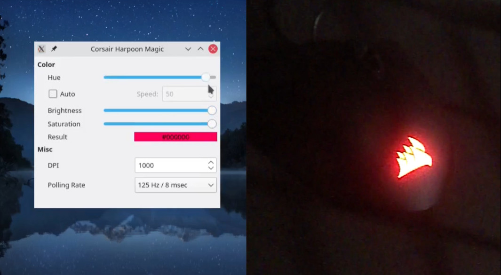

# harpoon-rgb-mouse
DIY Linux driver for the Corsair Harpoon RGB mouse

Learn how it was made: [Crafting simple hardware drivers with libusb](https://z64.me/post/crafting-drivers-libusb/)

See it in action ([YouTube video](http://www.youtube.com/watch?v=GkdJeEKSNBQ))

